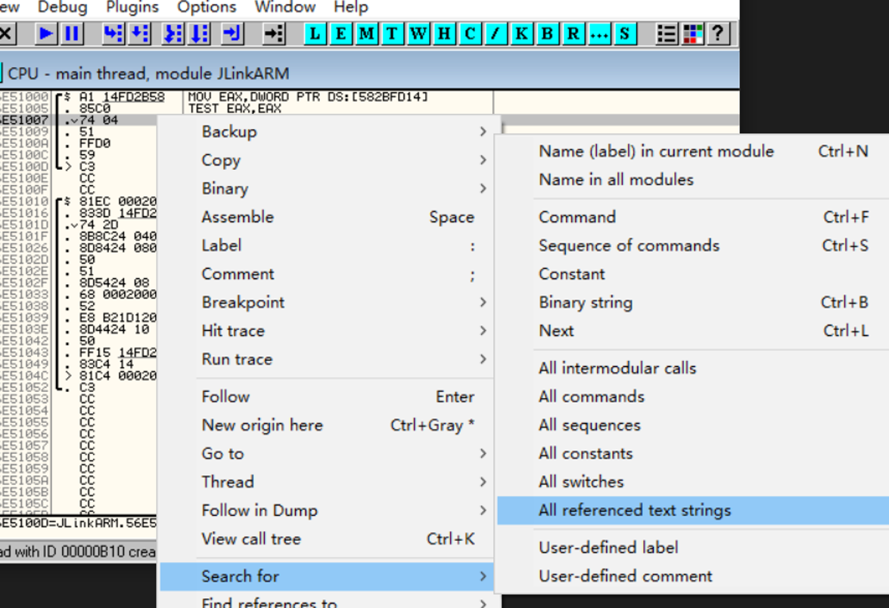

# 破解JLINK提示The connected J-Link is defective.
  

1. 下载ollydbg
2. 用ollydbg打开jlink.exe
3. Debug->run
4. 稍等一会(5秒),会出现警告框"The connected J-Link is defective",点确认  <br> 
5. 右键->view->JlinkArm<br>
6. 右键->Analysis->Analysis code   
7. 右键->Search for->All referenced text strings <br>
8. 在弹出的对话框查找"The connected J-Link is defective" <br>
9. 双击,跳到对应的代码窗口 <br>
10. 向上几行,找到循环0x1388的地方（0x1388换算10进制为5000，实际上这里的含义是软件开启5000ms，即5s后弹出这个提示警告框)
    <br>
   <br>记下相邻几行的代码,等下需要用工具把JNZ(75)改成JMP(EB)
    ```
    56EEF405   . 85C0           TEST EAX,EAX
    *56EEF407   . 75 59          JNZ SHORT JLinkARM.56EEF462
    56EEF409   . 6A 01          PUSH 1
    56EEF40B   . E8 40510800    CALL JLinkARM.56F74550
    56EEF410   . 46             INC ESI
    56EEF411   . 83C4 04        ADD ESP,4
    56EEF414   . 81FE 88130000  CMP ESI,1388
    ```
12. 接下来查找30秒后断开仿真的地方.查找循环0x7530(0x7530换算10进制为30000，实际上这里的含义是软件开启30000ms，即30s后断开仿真)
    <br>
    记下相邻几行的代码,等下需要用工具把JNZ(75)改成JMP(EB)
    ```
    56EEF498   . 85C0           TEST EAX,EAX
    56EEF49A   . 75 1A          JNZ SHORT JLinkARM.56EEF4B6
    56EEF49C   . 6A 01          PUSH 1
    56EEF49E   . E8 AD500800    CALL JLinkARM.56F74550
    ```
13. 用UE打开JLinkARM.dll,找到"85 C0 75 59 6A 01"改成""85 C0 EB 59 6A 01",找到"85 C0 75 1A 6A 01"改成""85 C0 EB 1A 6A 01"

14. 破解JLINK提示The connected J-Link (S/N..) has been designed to work with device made by ST only.
    
    用以上方法查找"The connected J-Link (S/N",并用UE把JNZ(75)改成JMP(EB)
    ```
    55F92806  |. 803D 67DF0357 >CMP BYTE PTR DS:[5703DF67],0
    55F9280D  |. 75 78          JNZ SHORT JLinkARM.55F92887
    55F9280F  |. 8B15 285A7056  MOV EDX,DWORD PTR DS:[56705A28]   ;  JLinkARM.56371988
    55F92815  |. 50             PUSH EAX
    55F92816  |. 8B82 8C000000  MOV EAX,DWORD PTR DS:[EDX+8C]
    55F9281C  |. 51             PUSH ECX
    55F9281D  |. FFD0           CALL EAX
    55F9281F  |. 50             PUSH EAX
    55F92820  |. 68 E8D63356    PUSH JLinkARM.5633D6E8        ;  ASCII "The connected J-Link (S/N %d) has been designed to 
    ```

